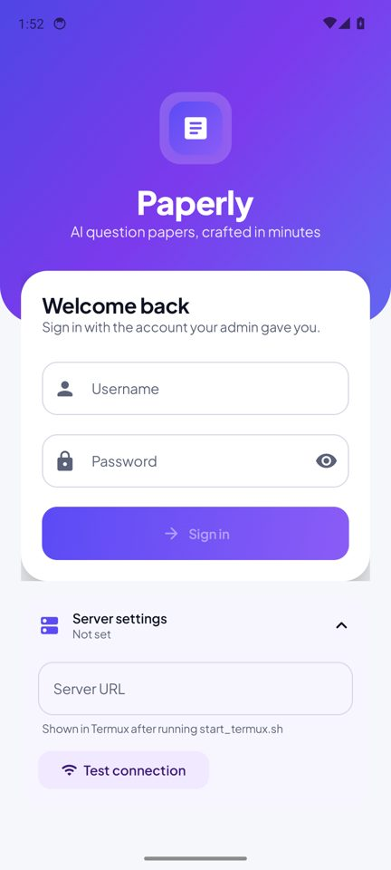
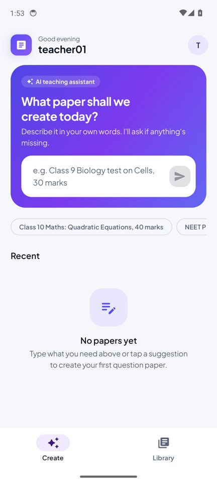
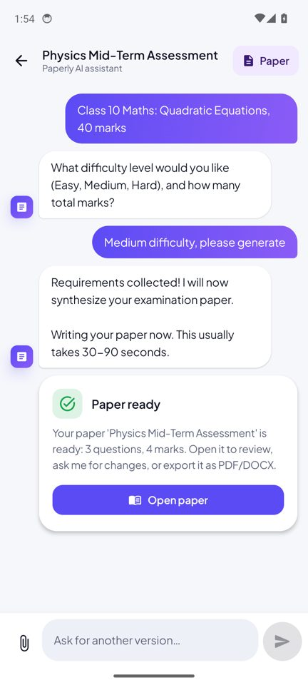
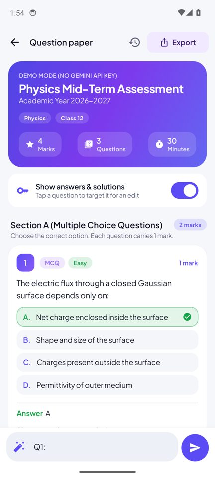
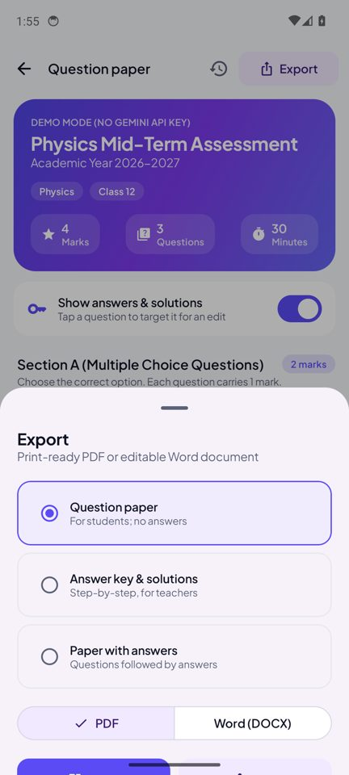
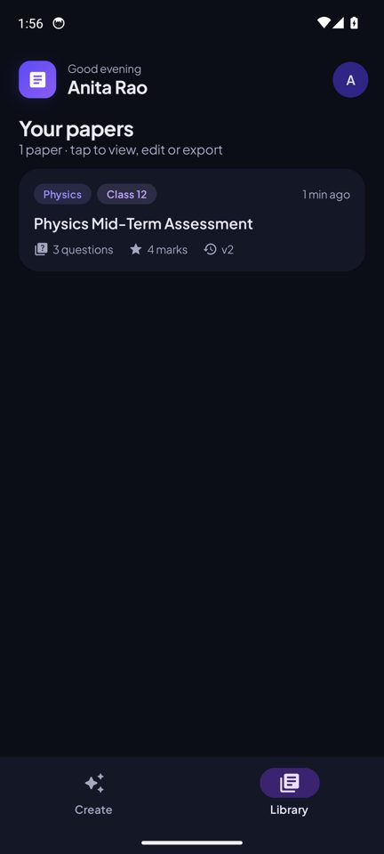

# Paperly 📝

> **AI question papers for teachers, in minutes.** Describe the paper you need in plain words, attach a syllabus if you like, and Paperly writes a complete, answer-checked question paper you can edit by chatting and export as **PDF** or **Word (DOCX)**.

The backend runs on an **old Android phone (Termux)** and uses **Google Gemini 3.8 Flash**. Teachers use the **Paperly Android app** from anywhere through a free Cloudflare tunnel.

| Sign in | Create | Chat | Paper | Export | Library (dark) |
| :---: | :---: | :---: | :---: | :---: | :---: |
|  |  |  |  |  |  |

---

## ✨ Features

- 💬 **Chat to create**: "Class 10 Maths, Quadratic Equations, 40 marks". Paperly asks only for what's missing.
- 📐 **Checked answers**: every numerical question is worked out and double-checked before the options are written.
- 📎 **Use your material**: attach PDF / DOCX / TXT notes or a syllabus as reference.
- ✏️ **Edit by chatting**: tap a question → "make Q3 harder", "add 2 case-study questions". Every change is a new version you can restore.
- 🖨️ **Export**: question paper, answer key & solutions, or paper with answers, as PDF or Word. Open, share (WhatsApp/email) or save to Downloads.
- 🔒 **Private**: no public sign-up. The admin creates accounts; logins are rate-limited; passwords are hashed with scrypt.

---

## 🚀 Setup: run the server on an old phone (Termux)

You need: an old Android phone (**Android 7 or newer**), Wi-Fi/mobile data on it, and ~1 GB free space.

### 1. Install Termux
Install **Termux from F-Droid** (<https://f-droid.org/packages/com.termux/>) or from its GitHub releases.
⚠️ Don't use the Play Store version; it's outdated and its packages fail to install.

### 2. Get a Gemini API key (free)
1. Open <https://aistudio.google.com/apikey> and sign in with a Google account.
2. Tap **Create API key** and copy it. You'll paste it in step 4.

### 3. Download Paperly in Termux
Open Termux and type these one at a time:
```bash
pkg update -y && pkg install -y git
git clone https://github.com/Pranav-PA/Paperly.git
cd Paperly/backend
```

### 4. Run the installer (one time, ~5–15 min)
```bash
bash scripts/install_termux.sh
```
It installs everything, **asks you to paste your Gemini API key**, creates **10 teacher accounts + 1 admin**, and tests Gemini.
Look for `Success! Gemini replied: OK` at the end.

See the logins any time:
```bash
cat credentials.txt
```

### 5. Start Paperly
```bash
bash scripts/start_termux.sh
```
After a few seconds it prints a box like:
```
  Server URL for the app (works from anywhere):
  https://random-words-here.trycloudflare.com
```
**Leave Termux open.** That's your server.

### 6. Keep it running reliably (recommended)
- Android **Settings → Apps → Termux → Battery → Unrestricted** (or "Don't optimize").
- Keep the phone **plugged in**; a wake-lock is taken automatically.
- Pull down the Termux notification and make sure it says *wake lock held*.

---

## 📱 Setup: the app on each teacher's phone

1. Download **`Paperly.apk`** from the [latest release](https://github.com/Pranav-PA/Paperly/releases/latest) and install it (allow "install unknown apps" when asked).
2. Open Paperly → tap **Server settings** → paste the URL from step 5 → **Test connection**.
   You should see **Connected · gemini-3.8-flash**.
3. Sign in with one of the accounts from `credentials.txt`. Teachers can change their password from the profile menu (top-right).
4. **Updates install from inside the app**: when a new version is released, Paperly shows an *Update available* popup → **Update** → **Install**. (The first time, Android asks you to allow Paperly to install apps; switch it on once.) You can also check manually from the profile menu → *Check for updates*.

> ℹ️ The free Cloudflare URL **changes every time you restart** `start_termux.sh`. When it changes, update it in the app under *Server settings* (you'll get a "can't find the server" message as a reminder).

---

## 🛠️ Everyday commands (in Termux, inside `Paperly/backend`)

| What | Command |
| --- | --- |
| Start server | `bash scripts/start_termux.sh` |
| Start for same Wi-Fi only (no tunnel) | `bash scripts/start_termux.sh --lan` |
| Stop server | `Ctrl + C` |
| Show logins | `cat credentials.txt` |
| New passwords for all accounts | `source .venv/bin/activate && python scripts/manage.py seed-accounts --reset` |
| Add a teacher | `source .venv/bin/activate && python scripts/manage.py create-user --username teacher11 --password Secret-1234` |
| Reset one password | `python scripts/manage.py reset-password --username teacher03 --new-password New-Pass-99` |
| Disable / enable a teacher | `python scripts/manage.py disable-user --username teacher05` |
| Test Gemini key & model | `python scripts/manage.py check-gemini` |
| Update the server | `git pull && bash scripts/install_termux.sh` |

Settings live in `backend/.env` (edit with `nano .env`): `GEMINI_MODEL=gemini-3.8-flash`, `GEMINI_THINKING_LEVEL=medium` (use `low` for faster papers, `high` for tougher maths), `MAX_CONCURRENT_GENERATIONS=4`.

---

## ❓ Troubleshooting

| Problem | Fix |
| --- | --- |
| App: "Can't find the server" | The tunnel URL changed. Copy the new one from Termux into *Server settings*. |
| App: "demo mode (no Gemini key)" | Put your key in `backend/.env` (`GEMINI_API_KEY=...`), then restart the server. |
| "Gemini rejected the API key" | Key is wrong or was deleted. Make a new one at aistudio.google.com/apikey. |
| Server stops when screen is off | Set Termux battery to **Unrestricted** (step 6). |
| Installer fails on `pydantic-core` | Your CPU has no prebuilt package; the script installs Rust and builds it (20–40 min). Keep the phone charging and run the installer again if it was interrupted. |

---

## 👩‍💻 Development

```bash
# Backend
cd backend
python3 -m venv .venv && source .venv/bin/activate
pip install -r requirements-dev.txt
cp .env.example .env            # add GEMINI_API_KEY (without it you get offline demo papers)
python scripts/manage.py seed-accounts
uvicorn app.main:app --reload   # http://localhost:8000/docs
pytest tests -q

# Android (JDK 17 + Android SDK 35)
cd android
./gradlew assembleDebug         # emulator reaches your PC's server at http://10.0.2.2:8000
```

**How generation works:** chat turns are answered directly; when the requirements are complete the server starts a background job (paper writing can exceed Cloudflare's 100-second request limit), and the app polls `GET /api/v1/jobs/{id}` until the paper is ready. Edits work the same way.

```text
backend/app/
  api/v1/      auth, conversations, papers, jobs endpoints
  services/    ai_service (Gemini), jobs (background tasks), pdf/docx export, text extraction
  core/        settings, SQLite (WAL), password hashing & JWT
android/app/src/main/java/com/paperly/app/
  data/        Retrofit API, repository (errors, polling, downloads), session storage
  ui/          login, home (create + library), chat, paper (viewer/editor/export), theme
```

## 📜 License
MIT. See `LICENSE`.

## 🚢 Releasing a new app version (maintainer)
1. Bump `versionCode` and `versionName` in `android/app/build.gradle.kts`.
2. `cd android && ./gradlew assembleRelease` (signed with the key from `keystore.properties`; always use the same key).
3. `gh release create vX.Y.Z android/app/build/outputs/apk/release/app-release.apk#Paperly.apk --notes "..."`. The release notes appear in the app's update popup.
