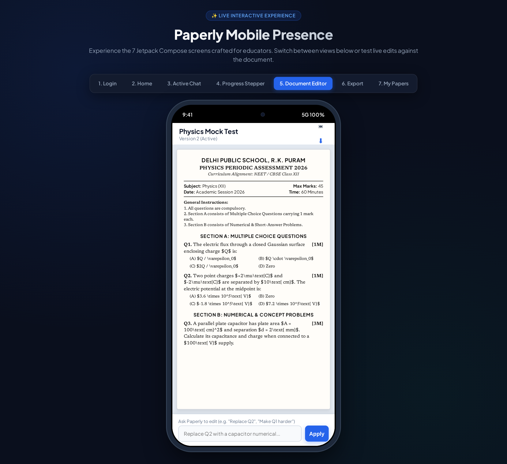
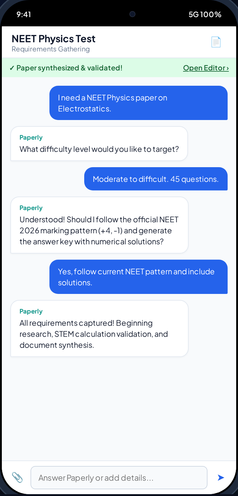
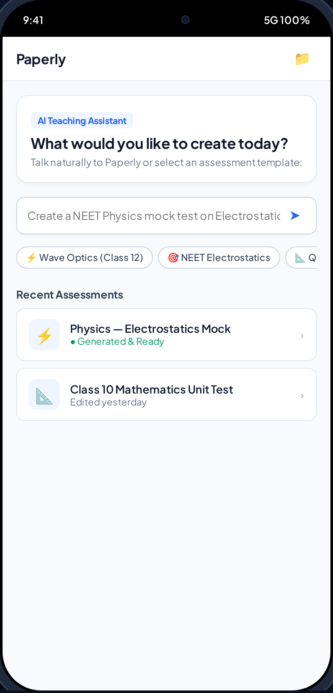
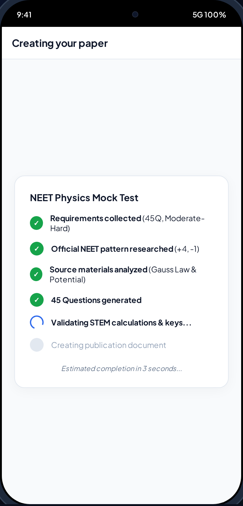
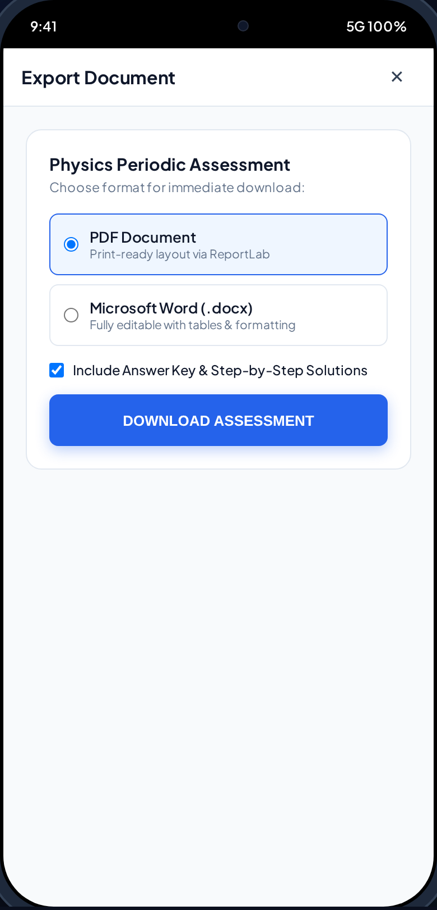
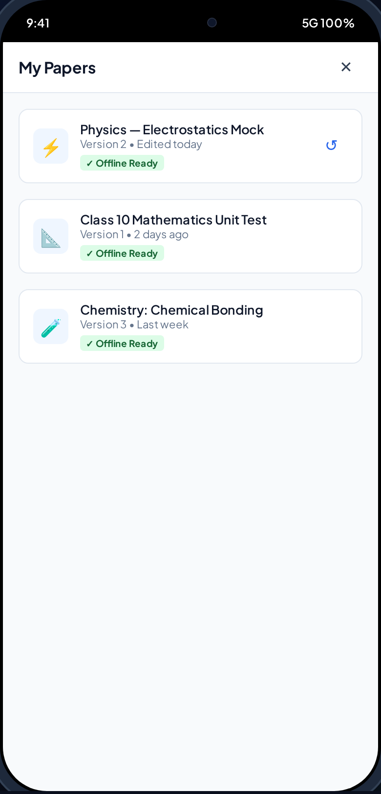

# Paperly 📝

> **AI-Powered Question Paper Generation & Pedagogical Document Workspace for Educators**

Paperly replaces cumbersome 30-field test generator forms with a natural conversational assistant. Educators can describe their assessment needs in plain language, attach curriculum notes or syllabi, and Paperly researches current patterns, verifies mathematical accuracy, and generates publication-grade question papers and step-by-step solutions exported to **print-ready PDF** and **editable DOCX**.

---

## 📱 Mobile UI Showcase

| Document Editor & Live Revision Drawer | Conversational Specification |
| :---: | :---: |
|  |  |

| Home & Assessment Launcher | Real-Time Synthesis Stepper |
| :---: | :---: |
|  |  |

| Multi-Format Export (PDF/DOCX) | Local History & Offline Access |
| :---: | :---: |
|  |  |

---

## ✨ Key Features

- 💬 **Chat-First Assessment Crafting**: Describe the test naturally (e.g., *"45-question NEET Physics paper on Electrostatics, moderate difficulty"*). Paperly asks clarifying questions one at a time.
- 📐 **STEM & Numerical Validation**: Built-in Critic Agent performs step-by-step calculations and verification scratchpads to prevent hallucinated formulas or flawed options.
- 📎 **Source Material Grounding**: Upload textbooks, lecture slides, or past papers (PDF, DOCX, TXT) with prompt-injection isolation boundaries.
- ✏️ **In-Place Conversational Revision**: Tap questions and chat directly against the live document (e.g., *"Replace Q3 with a numerical"*, *"Make Section B harder"*).
- 🖨️ **Multi-Format Export**: Pure-Python vector PDF generation (ReportLab) and styled Microsoft Word documents (`.docx`).
- 📱 **Low-Power Termux Ready**: Asynchronous FastAPI server optimized for SQLite in WAL mode with low memory footprint (<120MB RAM) designed to run on a repurposed Android smartphone.
- 🔒 **Zero-Trust Private Deployment**: No public signups; secure admin-provisioned user accounts via CLI (`python scripts/manage.py create-user`).

---

## 🚀 Step-by-Step Quick Start Guide

### Step 1: Clone the Repository
```bash
git clone https://github.com/Pranav-PA/Paperly.git
cd Paperly
```

---

### Step 2: Set Up & Configure the Backend

1. **Navigate to the backend directory and set up a Python virtual environment**:
   ```bash
   cd backend
   python3 -m venv .venv
   source .venv/bin/activate
   pip install --upgrade pip
   pip install -r requirements.txt
   ```

2. **Configure Environment Variables & API Key**:
   Copy the example environment template:
   ```bash
   cp .env.example .env
   ```
   Open `.env` in your preferred editor:
   ```env
   # Set your Google Gemini API Key
   GEMINI_API_KEY=your_actual_gemini_api_key_here
   GEMINI_MODEL=gemini-2.5-flash

   # Generate a secure secret for JWT tokens (e.g. openssl rand -hex 32)
   SECRET_KEY=replace_with_a_secure_random_key_in_production
   ```

3. **Provision an Educator Account (Admin CLI)**:
   Since Paperly uses a private deployment model with no public signups, create your teacher account via the CLI tool:
   ```bash
   python scripts/manage.py create-user --username teacher01 --password mypassword123 --full-name "Sarah Jenkins"
   ```

4. **Start the Backend Server**:
   ```bash
   uvicorn app.main:app --host 0.0.0.0 --port 8000 --reload
   ```
   - **Interactive Web Preview**: Visit `http://localhost:8000/` in your browser to experience the interactive mobile simulator.
   - **Interactive API Documentation**: Visit `http://localhost:8000/docs`.

---

### Step 3: Run on Android (Phone / Emulator)

#### Option A: Download the Pre-Built APK (GitHub Releases)
1. Go to the [Releases](https://github.com/Pranav-PA/Paperly/releases) tab in this repository.
2. Download `app-debug.apk`.
3. Sideload and install the APK on your Android device.

#### Option B: Build from Source in Android Studio
1. Open the `android/` directory in **Android Studio** (Hedgehog or newer).
2. Sync the project with Gradle files.
3. Configure the backend connection in `app/src/main/java/com/paperly/app/data/remote/NetworkClient.kt`:
   - For Android Emulator: `http://10.0.2.2:8000/` (default)
   - For Physical Device: Your Cloudflare Tunnel URL or LAN IP (`http://192.168.x.x:8000/`)
4. Click **Run** (`Shift + F10`) to deploy to your device or emulator.

---

### Step 4: Hosting the Backend on Termux (Repurposed Android Phone)

Paperly is uniquely engineered to run directly on an Android smartphone using Termux:
1. Install Termux on your old Android phone.
2. Clone the repository inside Termux:
   ```bash
   git clone https://github.com/Pranav-PA/Paperly.git
   cd Paperly
   ```
3. Run the automated installer:
   ```bash
   ./backend/scripts/install_termux.sh
   ```
4. Start the server (with CPU wake-lock to prevent OS sleep):
   ```bash
   ./backend/scripts/start_termux.sh
   ```

---

## 🧪 Automated Testing
Run the comprehensive test suite verifying authentication, conversational generation, in-place editing, DOCX/PDF export, and prompt-injection defense:
```bash
PYTHONPATH=backend pytest backend/tests -v
```

---

## 📂 Repository Structure

```text
Paperly/
├── .github/
│   └── workflows/
│       └── ci-cd.yml           # Automated Pytest CI, Android APK build, and GitHub Release
├── backend/
│   ├── app/
│   │   ├── api/v1/             # Auth, Conversations, and Papers endpoints
│   │   ├── core/               # Configuration, SQLite WAL database, JWT security
│   │   ├── models/             # SQLAlchemy ORM models
│   │   ├── schemas/            # PaperSchema AST and Pydantic validation
│   │   ├── services/           # Gemini AI orchestration, ReportLab PDF, python-docx
│   │   └── static/             # Interactive mobile web preview & simulator
│   ├── scripts/
│   │   ├── manage.py           # Administrative user provisioning CLI
│   │   ├── install_termux.sh   # Termux setup script
│   │   └── start_termux.sh     # Termux server daemon script
│   ├── tests/                  # Pytest test suite (10/10 passing)
│   ├── requirements.txt        # Backend dependencies
│   └── .env.example            # Environment template
├── android/
│   ├── app/
│   │   ├── src/main/java/com/paperly/app/
│   │   │   ├── data/local/     # Room Database, DAOs & Entities (offline-first)
│   │   │   ├── data/remote/    # Retrofit API service & DTOs
│   │   │   ├── data/repository/# Repositories for Auth, Chat, and Papers
│   │   │   ├── ui/screens/     # Jetpack Compose Screens 1 to 7
│   │   │   └── ui/theme/       # Material 3 typography and color palette
│   │   └── build.gradle.kts    # Android app module build script
│   ├── build.gradle.kts        # Root build script
│   └── settings.gradle.kts     # Gradle settings
└── docs/                       # BMAD Master Plan, System Architecture, Data Models
```

---

## 📜 License
Distributed under the MIT License. See `LICENSE` for more information.
